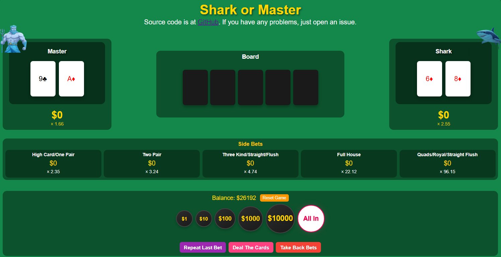

# Shark or Master 鯊魚大師

Pure frontend implementation of the Poker Master game from WPT Global.

純前端的單機版鯊魚大師 (WPT Global 裡面的一款遊戲)

Code mostly written by Github Copilot (mostly using Claude 3.7) and image is generated by Grok3 and Google Gemini.

## How to play?

The dealer will deal for master and shark first and we can see their cards.
Then we can place our bets on either master or shark.

System will calculate the odds of winning for each player and decide the multiplier.

For example if shark has a 60% chance of winning, the multiplier will be 1/0.6 = 1.67. Meaning if you bet 1000, you will win 1670 if shark wins.
Then after the betting is done, the dealer will reveal the cards and the winner will be decided by the rules of texas hold'em.

Additionally, this game features a side pot where you can bet on the winning hand's type.

For example, you can place a bet on "the winner will have two pairs," and so on.

Notice that there is a 5% of the pot that will be taken by the house.

Video of the original game: <https://www.youtube.com/shorts/J4tE9997V9A>

莊家會先發牌給鯊魚和大師，並且我們可以看到他們的兩張手牌。
接著，我們可以選擇下注在鯊魚或大師 (可以兩邊都下注)。
系統會根據鯊魚與大師的勝率來計算賠率。
如果鯊魚有 60% 的勝率，那賠率就是 1 / 0.6 = 1.67。
也就是說，如果你下注鯊魚 1000 元，且鯊魚獲勝，你將贏得 1670 元。

下注結束後，莊家會亮出公牌，並依照德州撲克的規則決定勝負。

另外，這個遊戲設有邊池，可以猜測贏家的牌型，例如可以壓注「贏家會有兩對」等。

請注意：彩池中的 5% 會被平台抽成。

實際遊玩可以參考大泓老師的影片: <https://www.youtube.com/shorts/J4tE9997V9A>

## Disclaimer

For entertainment purposes only.

All money and bets in this game are virtual and have no real-world value.

Please play responsibly.

The copyright of original game is owned by WPT Global and I don't own any rights to it.

僅供娛樂用途。

本遊戲中的所有金錢與投注皆並無任何現實世界的價值。

請理性遊玩。

**永遠支持大泓老師的鯊魚大師環節**
